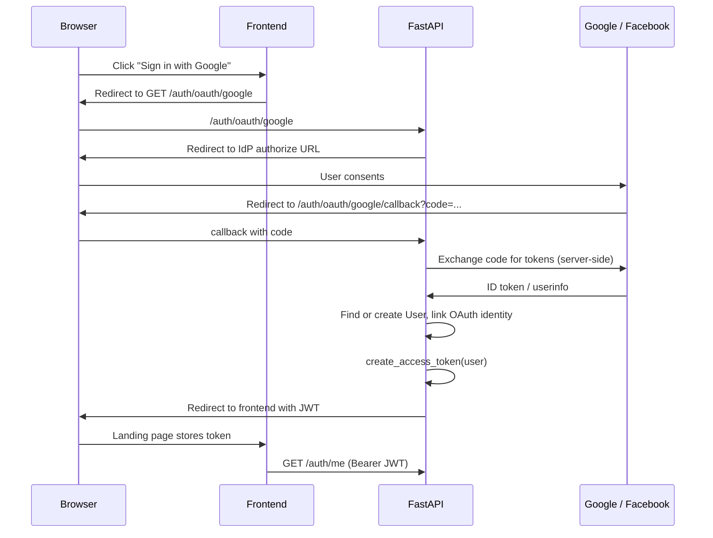

# OAuth SSO Design (Google & Facebook)

Architecture decisions for RideConnect social login. **Task 1 only** — no implementation in this document.

## Goals

- Let users sign in or register with Google or Facebook alongside existing email/password auth.
- Keep authentication logic centralized in the FastAPI backend where JWT issuance and future verification gating already live.
- **OAuth is authentication only.** It does not satisfy KYC identity verification requirements.

---

## Decision 1: Backend-owned OAuth flow

### Chosen approach

Frontend initiates login by redirecting the browser to backend OAuth routes. The backend:

1. Redirects to Google/Facebook authorization.
2. Receives the provider callback.
3. Exchanges the authorization code for tokens (server-side).
4. Reads the provider user profile (email, subject ID, verified-email claim).
5. Creates or links a `User` record.
6. Issues the **same JWT** used by `/auth/login` today.
7. Redirects the browser back to the frontend with the token (or sets it via a short-lived exchange — see implementation tasks).

### Rejected alternative: frontend-only NextAuth.js

NextAuth would own the OAuth dance in Next.js and issue its own session. That splits auth concerns across two runtimes and duplicates verification-gating logic the MVP will enforce in FastAPI (listings, bookings, friend invites blocked for `verification_status != verified`).

Keeping OAuth in FastAPI:

- Reuses `create_access_token` / `get_current_user` unchanged.
- Keeps account linking and audit in one place next to `User`.
- Matches the existing frontend pattern: store bearer token, call `/auth/me`.

### Flow (high level)

### Fit with existing auth

| Piece | Today | After OAuth |
|-------|-------|-------------|
| Registration | `POST /auth/register` (email + password) | Unchanged; OAuth is an additional path |
| Login | `POST /auth/login` → JWT | Unchanged for password users |
| Session | HS256 JWT, `sub` = user UUID | Same JWT from OAuth callback |
| Frontend storage | `localStorage` (`rideconnect_token`) | Same; OAuth landing hands off token |
| Protected routes | `HTTPBearer` → `get_current_user` | Unchanged |

Relevant code today: `backend/app/routers/auth.py`, `backend/app/services/security.py`, `backend/app/dependencies.py`, `frontend/lib/auth.ts`.

---

## Decision 2: Authlib

Use **[Authlib](https://docs.authlib.org/)** (`authlib` + Starlette/FastAPI integration) for OAuth 2.0 client flows with Google and Facebook.

### Rationale

- FastAPI/Starlette-native; fits existing stack without a separate auth framework.
- Single library for both providers (OAuth2 + OpenID Connect for Google; OAuth2 for Facebook).
- Handles authorize URL construction, state/PKCE, and token exchange — avoids hand-rolled OAuth2 security mistakes.

### Not chosen

- **Hand-rolled OAuth2** — higher risk for state validation, redirect URI handling, and token parsing bugs.
- **NextAuth.js** — see Decision 1.
- **Provider-specific SDKs only** — two codepaths instead of one abstraction.

Dependency to add in a later task: `authlib` (not in `requirements.txt` yet).

---

## Decision 3: Account linking strategy

### Rules

1. **Primary key remains `users.id`.** One human → one `User` row.
2. **Link by verified email:** If the OAuth provider returns an email that matches an existing `users.email` **and** the provider marks that email as verified (`email_verified` for Google; Facebook `email` only when present and account is in good standing), attach the OAuth identity to that user — do not create a duplicate account.
3. **New user:** If no user exists for the verified email, create a `User` with `verification_status = unverified` (KYC default).
4. **Provider subject is authoritative for that provider:** Store `(provider, provider_user_id)` on a separate identity record (see Model gaps). A Google `sub` or Facebook `id` always maps to exactly one `user_id`.
5. **Cross-provider linking:** If User A already linked Google, and Facebook returns the same verified email, link Facebook to the same `user_id` (second row in identity table).
6. **No link without verified email:** If the provider does not return a verified email, fail the login with a clear error — do not guess or prompt for a different email in the OAuth callback (handle in a later UX task).

### Password + OAuth coexistence

- Linked users may sign in with **either** password or any linked provider.
- Linking does **not** reset or upgrade `verification_status`. An existing verified KYC user keeps `verified`; an unverified password user stays `unverified` after linking Google.

### Cases to reject or defer (implementation tasks)

| Case | Behavior |
|------|----------|
| OAuth email unverified | 403/400; ask user to use password or another method |
| `(provider, provider_user_id)` already tied to user B, email matches user A | 409 conflict; manual support / explicit "link accounts" flow later |
| OAuth email matches user A, but user already has same provider linked to different subject | 409; possible account takeover — reject and log |
| User has OAuth only, wants password login later | Optional "set password" endpoint later |
| Minor accounts (`is_minor`, `guardian_user_id`) | OAuth does not bypass guardian rules; no special case in OAuth MVP |

---

## Authentication vs KYC (non-negotiable)

| | OAuth / SSO | KYC (`verification_status`) |
|---|-------------|-------------------------------|
| **Proves** | User controls a Google/Facebook account | User identity checked for marketplace safety |
| **Sets** | JWT session only | `users.verification_status` via `VerificationRecord` |
| **New OAuth user default** | `verification_status = unverified` | Must complete KYC before gated actions |
| **Blocks** | Nothing beyond "not logged in" | Listings, booking requests, friend invites (per MVP rules) |

**SSO users are not verified riders/owners.** OAuth proving email ownership is necessary but not sufficient for trust-and-safety KYC. Future KYC (Stripe Identity, Persona, or admin queue) writes to `VerificationRecord` and updates `verification_status` independently of how the user authenticated.

Document this in API responses and frontend copy: "Signed in with Google" ≠ "Identity verified for rides."

---

## Data model compatibility

Reference: `docs/data-model.md` (there is no `data-model-sketch.md` in the repo). Implemented model: `backend/app/models/user.py`, migration `001_create_users.py`.

### What already fits

| Field / concept | OAuth use |
|-----------------|-----------|
| `users.email` (unique) | Lookup key for linking when provider email is verified |
| `users.verification_status` | Always `unverified` for brand-new OAuth users; unchanged when linking to existing user |
| `users.is_rider`, `is_owner`, `is_admin`, `is_minor`, `guardian_user_id` | Set defaults on create; OAuth does not auto-set admin or verified |
| JWT `sub` = `users.id` | Works for OAuth-created users immediately |

### `VerificationRecord` (documented, not implemented)

`docs/data-model.md` defines `VERIFICATION_RECORD` with `provider`, `provider_reference_id`, `status`, `verified_at`, `expires_at`. **No SQLAlchemy model or migration exists yet.** That is correct for this plan: KYC records will be created by the verification pipeline, not by the OAuth login path. OAuth must **not** insert `VerificationRecord` rows or set `verification_status` to `verified`.

### Gaps requiring follow-up migrations (Tasks 2+)

1. **`password_hash` is `NOT NULL` today.** OAuth-only users have no password. Options (pick one in implementation):
   - Make `password_hash` nullable (`NULL` = OAuth-only), or
   - Store a random unusable hash for OAuth-only accounts.
   - Prefer **nullable** for clarity and to avoid fake password semantics.

2. **No OAuth identity storage.** Need a table such as `oauth_accounts` (names tentative):

   | Column | Purpose |
   |--------|---------|
   | `id` | PK |
   | `user_id` | FK → `users.id` |
   | `provider` | `google` \| `facebook` |
   | `provider_user_id` | Stable IdP subject (`sub` / `id`) |
   | `provider_email` | Snapshot at link time (audit) |
   | `created_at` | Audit |

   Unique constraints: `(provider, provider_user_id)` and optionally one row per `(user_id, provider)`.

3. **No verification gate helpers yet.** Listing/booking/friend endpoints are not built; when they are, they must check `verification_status` regardless of auth method. OAuth does not change that contract.

4. **`phone` on User** — optional; OAuth may supply nothing. Do not treat OAuth profile phone as verified contact without KYC.

---

## Environment variables (overview)

Add to `.env` / `Settings` in implementation tasks:

| Variable | Purpose |
|----------|---------|
| `GOOGLE_CLIENT_ID` | Google OAuth client |
| `GOOGLE_CLIENT_SECRET` | Google token exchange |
| `FACEBOOK_APP_ID` | Facebook app identifier |
| `FACEBOOK_APP_SECRET` | Facebook token exchange |
| `OAUTH_CALLBACK_BASE_URL` | Public API base for redirect URIs (e.g. `http://localhost:8000`) |
| `FRONTEND_OAUTH_SUCCESS_URL` | Where to send browser after JWT issued (e.g. `http://localhost:3000/auth/callback`) |
| `FRONTEND_OAUTH_ERROR_URL` | Error landing with query params |

Existing (unchanged):

| Variable | Purpose |
|----------|---------|
| `JWT_SECRET`, `JWT_ALGORITHM`, `ACCESS_TOKEN_EXPIRE_MINUTES` | Session JWT after OAuth |
| `CORS_ORIGINS` | Must include frontend origin for API calls post-login |

Redirect URI examples (register in provider consoles):

- `{OAUTH_CALLBACK_BASE_URL}/auth/oauth/google/callback`
- `{OAUTH_CALLBACK_BASE_URL}/auth/oauth/facebook/callback`

---

## Security notes (for implementation)

- Use OAuth **state** (and PKCE where supported) on every authorize redirect.
- Validate ID token issuer/audience for Google; use Facebook's token debug or `/me` with app secret proof.
- Only trust **verified** email claims for account linking.
- Log OAuth sign-in events (user id, provider, new vs link) for audit — align with MVP "everything auditable" rule.
- Never pass provider access tokens to the frontend; only issue our JWT.

---

## Out of scope for this design / later tasks

- Implementing routes, migrations, or UI (Tasks 2–6).
- Using OAuth as KYC or auto-setting `verification_status = verified`.
- Social login for minors without guardian flow.
- Account unlinking, email change, or "merge duplicate accounts" admin tools.
- Refresh tokens (current MVP uses short-lived access JWT only).

---

## Summary

| Decision | Choice |
|----------|--------|
| Auth flow | Backend-owned OAuth → same JWT as password login |
| Library | Authlib |
| Account linking | Same `user_id` when verified provider email matches existing `users.email` |
| KYC | Independent; OAuth users start `unverified` |
| Model readiness | `User` + `verification_status` fit; need `oauth_accounts` table and nullable `password_hash`; `VerificationRecord` not built yet (OK) |
