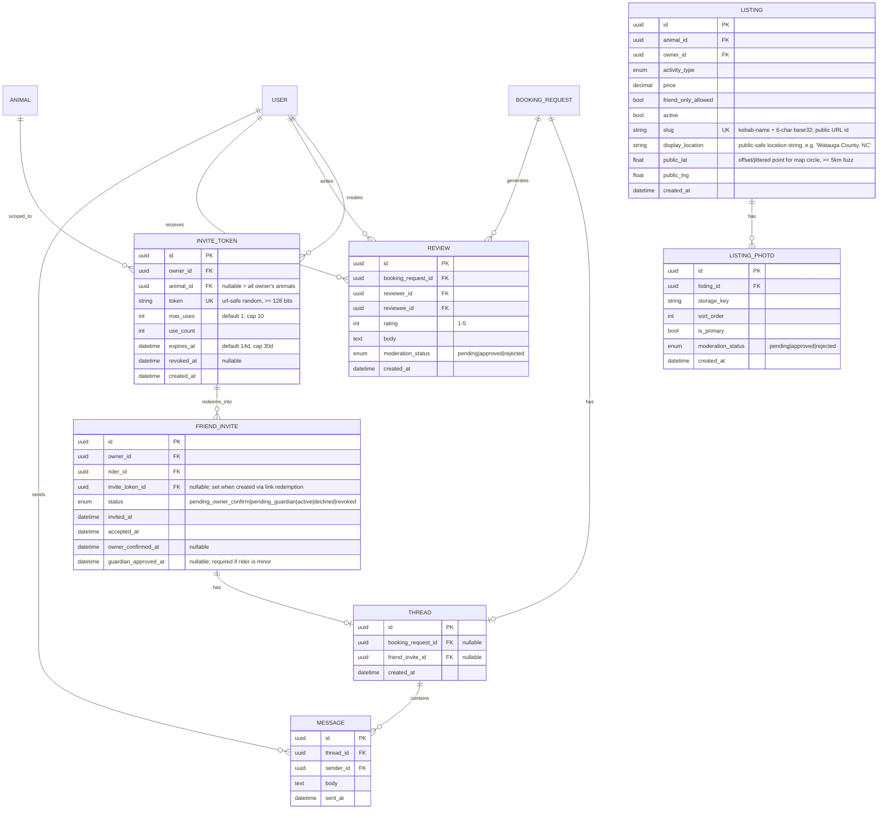

# Data Model Additions — Public Listings, Invites, Threads, Reviews

Companion to `data-model-sketch.md`. Same convention: paste the Mermaid block into
Obsidian Excalidraw's Mermaid import for an editable ERD. This file contains only
the **new and changed** entities; unchanged entities from the base sketch are shown
without attribute lists where they appear only for relationship context.

## Migration & constraint notes

### THREAD (replaces MESSAGE → BOOKING_REQUEST FK)

- **Why:** `anti-trafficking.md` allows messaging on booking **or** friend-invite
  threads; the old model only supported bookings. A thread table also gives
  moderation tooling one uniform surface.
- Check constraint: exactly one parent —
  `CHECK ((booking_request_id IS NULL) <> (friend_invite_id IS NULL))`
- Partial unique indexes so each booking/invite has at most one thread.
- Migration: create `THREAD`, backfill one thread per existing `BOOKING_REQUEST`
  that has messages, repoint `MESSAGE.booking_request_id` → `MESSAGE.thread_id`,
  drop old column. (Trivial now; painful after launch — do it first.)
- Thread creation rule (application layer): a friend-invite thread opens only when
  `FRIEND_INVITE.status = active`. No pre-confirmation chat — otherwise invite
  redemption becomes an open-DM loophole.

### FRIEND_INVITE changes

- `status` enum expanded: `pending_owner_confirm` (link redeemed, owner hasn't
  confirmed identity) and `pending_guardian` (redeemer is a minor awaiting guardian
  approval) precede `active`.
- Free bookings (`BOOKING_REQUEST.payment_type = free`) require the referenced
  invite to be `active` — unchanged rule, stricter states.
- `invite_token_id` nullable: direct in-app invites (rider already known) skip the
  token path and go straight to the old flow.

### INVITE_TOKEN

- `token` generated with `secrets.token_urlsafe(24)`; treat like a password-reset
  token (no logging in plaintext, constant-time compare not required since random,
  but index it).
- Enforce in application logic: redemption requires redeemer `verification_status =
  verified`; increment `use_count` atomically (`UPDATE ... WHERE use_count <
  max_uses AND revoked_at IS NULL AND expires_at > now() RETURNING ...`) to prevent
  race-condition over-redemption.
- Rate limits (per spec): ≤10 active tokens/owner; ≤25 redemptions/owner/30d →
  exceed queues admin review. Both are simple COUNT queries against this table —
  this is the clean signal source for the pattern-flag system.

### REVIEW

- Only for bookings with `status = completed`; one review per (booking, reviewer).
  Unique index on `(booking_request_id, reviewer_id)`.
- Double-blind publish (both submitted, or 14-day window elapses) prevents
  retaliation reviews — cheap to implement now, hard to retrofit norms later.
- `moderation_status` defaults `pending` only if/when content moderation is on;
  during free launch you may auto-approve and spot-check via admin queue.
- Verified-Friend rides **do** generate review eligibility (they're completed
  rides), but are labeled "Friend ride" on display so paid-booking reviews aren't
  diluted.

### LISTING changes

- `slug`: unique, immutable after creation. Generate at listing creation, retry on
  collision.
- `display_location` + `public_lat/lng`: computed once from the true address
  (county name or "≈X min from {nearest town}"; jittered point ≥5 km). **The true
  `ANIMAL.lat/lng/address` must never appear in any public serializer.** Keep a
  dedicated `PublicListing` Pydantic response model and serialize public endpoints
  exclusively through it — allowlist, not blocklist.

### LISTING_PHOTO

- Store in object storage (S3-compatible on Render/Railway); `storage_key` not URL,
  generate signed/public URLs at read time.
- Strip EXIF on upload (GPS coordinates in photo metadata would leak the true
  location straight past the display_location protections — Pillow:
  `Image.open(f).save(out, exif=b"")`).
- `moderation_status` present from day one even if auto-approved initially.
